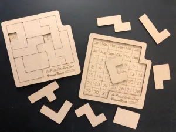
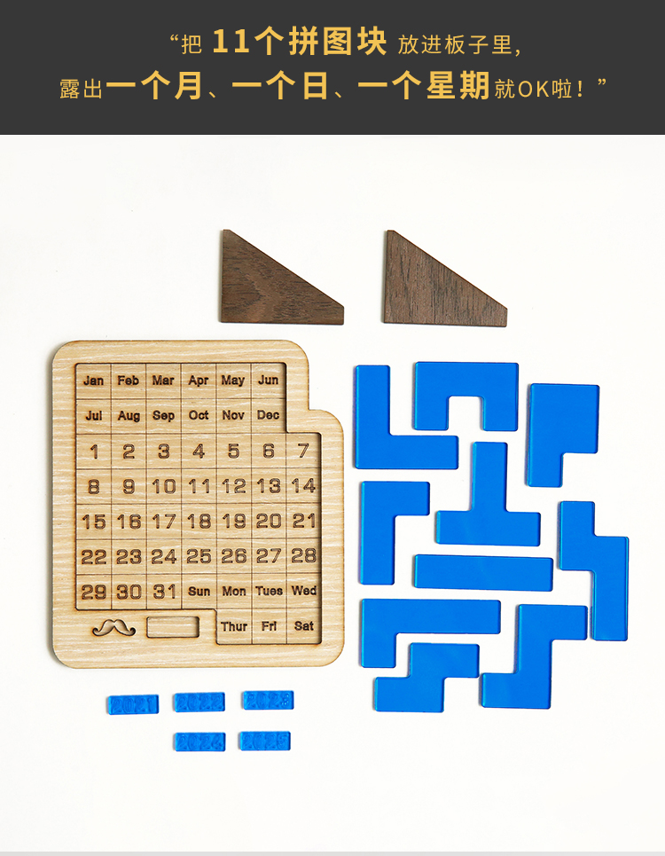
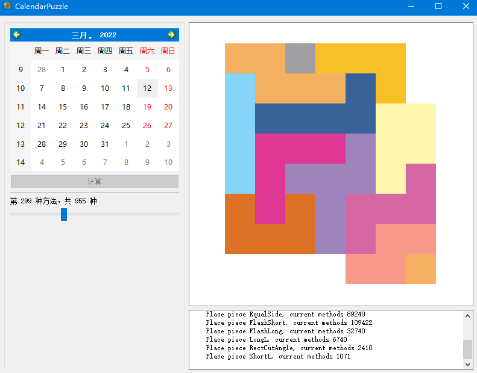

# CalendarPuzzle

基于QT5实现的日历拼图小游戏 

## 日历拼图  

该拼图游戏出自 [Dragonfjord](https://www.dragonfjord.com) 网站，原名叫 A-Puzzle-A-Day。
后经国人二次研发，推出了带星期的版本。本项目针对的是带星期的版本。

#### 不带星期的版本
   

#### 带星期的版本
  

这两个游戏的玩法相同，都是将给定积木块全部拼进去以后
正好可以剩下两个或者三个空位。经验证可以拼出任意一个日期组合，且每一个日期都有多种拼法，目前我
测试的带星期版本，最少的都有140种拼法。3月12日，周六有955种拼法。如下所示的其中三种拼法。

#### 其一

#### 其二

#### 其三

## 编译安装

该项目基于 QT-5.14.2 + QtCreator-4.11 + MinGW-7.3.0-64bit 开发。
编译完成后，运行程序，如下图所示：

